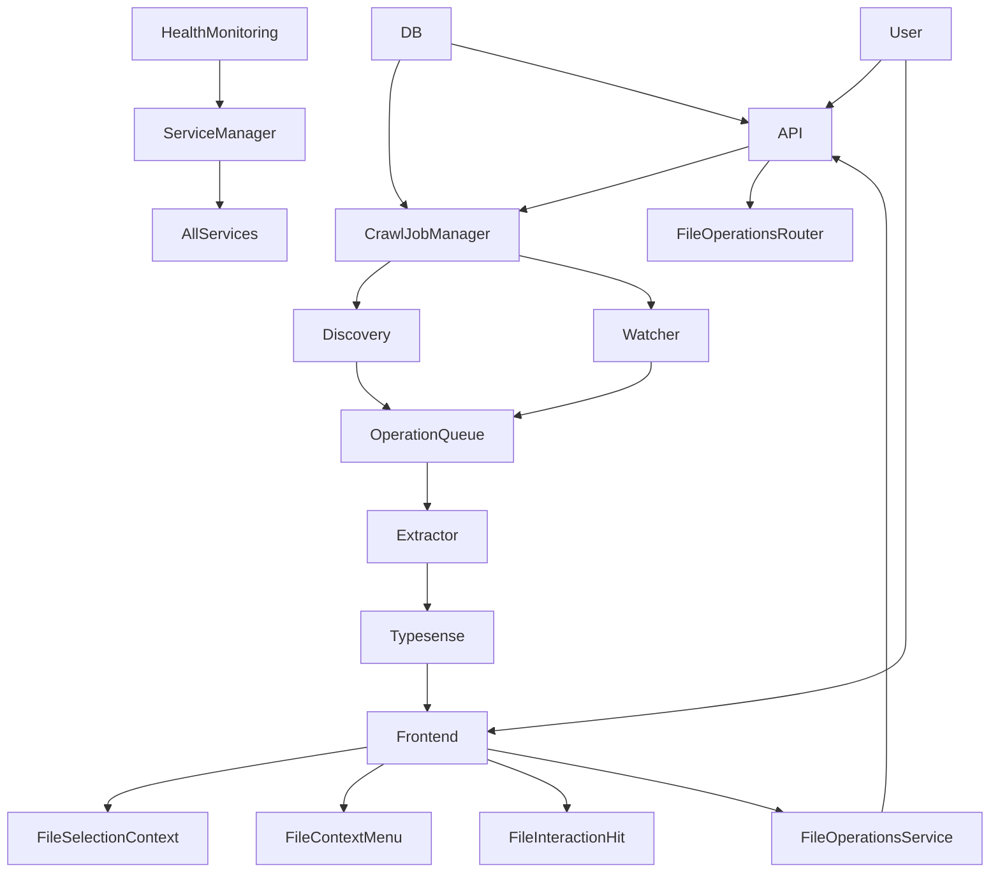

# Architecture: File Brain

## Overview
Backend is a FastAPI service coordinating filesystem discovery, content extraction, and Typesense indexing with real time monitoring. Frontend is a minimal React InstantSearch client for search and triage.

Key orchestrators:
- [critical_init()](main.py:23) initializes critical services (database) that block startup.
- [background_init()](main.py:62) initializes non-critical services (Typesense, crawl manager, file watcher) in background.
- [ServiceManager](services/service_manager.py:39) tracks service health and initialization status.
- [CrawlJobManager](services/crawl_job_manager.py:46) runs discovery, indexing, and optional monitoring.
- [FileWatcher](services/watcher.py:16) converts OS events into crawl operations.
- [health_monitoring_loop()](main.py:317) performs continuous service health monitoring.

## Core components
- API Routers: [router](api/crawler.py:25), [router](api/configuration.py:1), [router](api/system.py:1), [router](api/files.py:1)
- Settings: [Settings(BaseSettings)](config/settings.py:12)
- DB: [Base](database/models/base.py:9), [SessionLocal](database/models/base.py:19)
- Models: [CrawlerState](database/models/crawler_state.py:9), [Setting](database/models/setting.py:9), [WatchPath](database/models/watch_path.py:9)
- Extraction: [ContentExtractor](services/extractor.py:23), [get_extractor()](services/extractor.py:156)
- Search: [TypesenseClient](services/typesense_client.py:14), [initialize_collection()](services/typesense_client.py:29)
- Operations: [OperationType](api/models/operations.py:10), [CrawlOperation](api/models/operations.py:17)

## Frontend Architecture
- **File Selection Management**: [FileSelectionContext](frontend/src/context/FileSelectionContext.tsx:1) for centralized file selection state
- **Interactive Components**: 
  - [FileInteractionHit](frontend/src/components/FileInteractionHit.tsx:1) for interactive search result cards
  - [FileContextMenu](frontend/src/components/FileContextMenu.tsx:1) for right-click file operations
- **File Operations**: [fileOperations.ts](frontend/src/services/fileOperations.ts:1) service for handling file operations
- **InstantSearch Integration**: [App.tsx](frontend/src/App.tsx:1) using Typesense adapter and index files

## Lifecycle
1. Startup: [critical_init()](main.py:23) initializes database synchronously, [background_init()](main.py:62) starts non-critical services asynchronously, [health_monitoring_loop()](main.py:317) begins continuous monitoring.
2. Running: discovery and indexing run concurrently; optional watcher streams changes.
3. Shutdown: [stop_crawl()](services/crawl_job_manager.py:131) stops tasks and watcher.

## Discovery
- Filesystem walk emits [CrawlOperation](api/models/operations.py:17) with operation create.
- Implemented by [_discover_files()](services/crawl_job_manager.py:390) and [_discover_files_in_path()](services/crawl_job_manager.py:442) using thread pool.
- Progress persisted via [DatabaseService.update_crawler_state](services/database_service.py:193).

## Monitoring
- Watchdog observer via [create_watcher_for_crawl()](services/watcher.py:205) produces events handled by [OperationEventHandler](services/watcher.py:109).
- Events are mapped to operations and enqueued to the shared queue.

## Indexing
- Worker loop [_index_files()](services/crawl_job_manager.py:524) consumes operations.
- For create or edit, content is extracted by [ContentExtractor](services/extractor.py:23) and upserted via [index_file()](services/typesense_client.py:77).
- For delete, removal happens via [remove_from_index()](services/typesense_client.py:143).
- Idempotency: before reindex, compares file_hash against existing doc via [get_doc_by_path()](services/typesense_client.py:61).

## File Operations API
- **File Operations Router**: [router](api/files.py:1) provides endpoints for file management operations
- **Supported Operations**: open, delete, move, copy, rename, and other file system operations
- **Frontend Integration**: File selection state managed via React context, operations triggered through context menus
- **User Feedback**: Integration with NotificationContext for operation status and error handling

## Typesense schema and search
- Collection schema defined in [get_collection_schema()](config/typesense_schema.py:7) with facets and embedding.
- Search parameters exposed via frontend; server wrapper offers [search_files()](services/typesense_client.py:156).

## State and metrics
- Persistent state in [CrawlerState](database/models/crawler_state.py:9) tracks job status and progress.
- Settings in [Setting](database/models/setting.py:9) store booleans like crawler_start_monitoring.
- Stats counters updated through [DatabaseService](services/database_service.py:12).
- **File Selection State**: Managed via [FileSelectionContext](frontend/src/context/FileSelectionContext.tsx:1) for interactive file operations.

## Concurrency model
- Async tasks for crawl and indexing in [CrawlJobManager](services/crawl_job_manager.py:46).
- CPU bound or blocking file IO offloaded to ThreadPoolExecutor in discovery.
- Bounded asyncio queue provides back pressure.
- Watcher thread posts into loop using call_soon_threadsafe.

## API surface
- **Crawler Control**: [start_crawler()](api/crawler.py:40), [get_crawler_status()](api/crawler.py:129), [stop_crawler()](api/crawler.py:146)
- **Index Management**: [clear_all_indexes()](api/crawler.py:185)
- **Settings**: [get_crawler_settings()](api/crawler.py:231), [update_crawler_settings()](api/crawler.py:248)
- **System**: [get_initialization_status()](api/system.py:25) for service health and initialization status
- **File Operations**: [router](api/files.py:1) for interactive file management operations

## Frontend
- InstantSearch client in [App.tsx](frontend/src/App.tsx:1) using Typesense adapter and index files.
- **Interactive File Management**: Enhanced search results with selection, context menus, and file operations.
- **Provider Pattern**: FileSelectionProvider wraps SearchPage for centralized selection state management.

## Invariants
- Typesense is source of truth for index. All writes are upserts.
- Indexing is idempotent; unchanged files are skipped based on file_hash.
- Indexing progress clamps below 100 when queue is not empty; see [get_status()](services/crawl_job_manager.py:182).

## Failure handling
- Extraction fallback path in [ContentExtractor._extract_basic](services/extractor.py:119).
- Queue timeouts and retries in [OperationEventHandler._enqueue_operation](services/watcher.py:180).
- Health endpoint checks Typesense connectivity in [health_check](main.py:396).
- Service health monitoring with automatic retry and failure tracking.

## Diagram

## Service Health Management
- [ServiceManager](services/service_manager.py:39) tracks initialization state and health of all services
- Health checkers registered for: database, typesense, crawl_manager, file_watcher
- Background monitoring runs every 30 seconds to verify service health
- Failed services are automatically retried with exponential backoff
- API endpoints expose real-time service status to frontend

## Notes and extensions
- Embeddings configured to ts e5 small v2; model can be swapped in [get_collection_schema()](config/typesense_schema.py:7).
- Max file size controlled via settings and env; see checks in [CrawlJobManager._handle_create_edit_operation](services/crawl_job_manager.py:590).