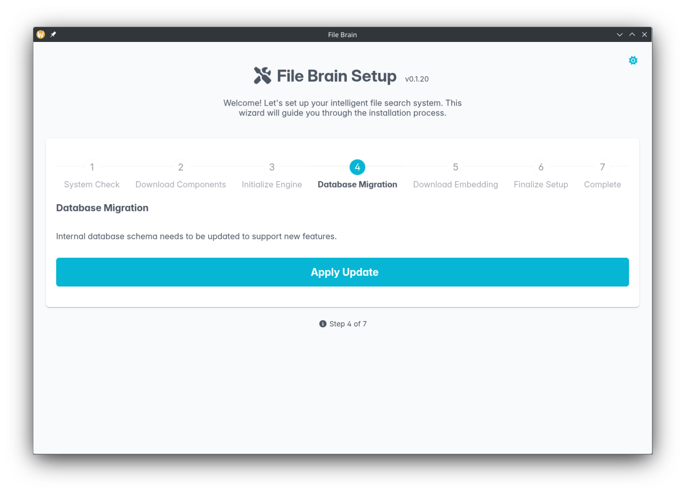
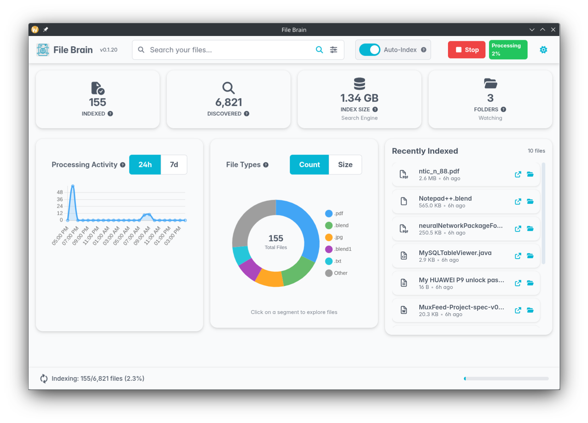
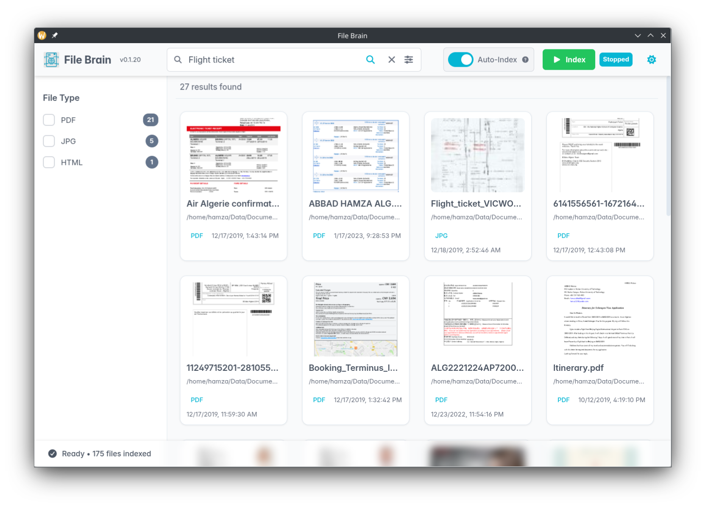

# File Brain

**Your Local AI Search Engine**

Find what you mean, not just what you say. File Brain runs locally on your machine to index and understand your files.

## What is File Brain?

File Brain is a desktop application that helps you find files instantly using natural language. Instead of remembering exact filenames, you can ask questions like "flight ticket invoice", and File Brain uses AI to understand the meaning and show the relevant files.

## Key Features

- **🧠 Find what you mean**: Uses advanced Semantic Search -in addition to full text search- to understand the intent behind your query (e.g., search for "worker", find documents mentioning "employee").
- **📝 Typo Resistance**: Robust against typos. Search for "iphone" even if you typed "ipnone".
- **📄 Supports Everything**: Extracts the content of over 1400+ file formats (PDF, Word, Excel, PowerPoint, images, archives, and more).
- **🌍 Cross-Language Search**: Search in one language to find documents written in another (e.g., search for "Chair", find documents mentioning "Silla" -in Spanish-).
- **🚀 Fast Matching**: Search results are shown within milliseconds, not minutes.
- **👁️ OCR Support**: Automatically extracts text from screenshots, and scanned documents.
- **⚡ Auto-Indexing**: Detects changes in real-time and updates the index instantly.
- **🔒 Privacy First**: All indexing and AI processing happens 100% locally on your machine. Your data never leaves your computer.

## Prerequisites

- **Python 3.11** or higher
- **Docker** or **Podman** (Must be installed and ready to run)

## Installation

Install File Brain easily using pip:

```bash
pip install file-brain
```

## Getting Started

1.  **Run the App**:

    ```bash
    file-brain
    ```

2.  **Initialization Wizard**:
    On the first run, a simple wizard will guide you:

    1.  **System Check**: Verifies Docker is running.
    2.  **Download Components**: Downloads the necessary search services.
    3.  **Initialize Engine**: Starts the background search components.
    4.  **Download AI Model**: Fetches the AI model for intelligent search.
    5.  **Finalize Setup**: Initializes the search engine database.

    
    _The easy-to-use setup wizard that guides you through downloading models and initializing the search database._

3.  **Select Folders**:
    Choose the folders you want to index via the dashboard settings.

4.  **Indexing**:

    - **Manual Indexing**: Performs a deep scan of all files. Great for initial setup.
    - **Auto-Indexing**: Watches for new or changed files and processes them instantly.

    > **Note**: File Brain must be running for the background indexing to process your files.

## Visualizing the Interaction

### Dashboard

See all your indexed files, storage usage, and recently indexed files at a glance.



### Semantic Search

Search naturally, like "Airplane ticket" to find relevant documents even if the filename is different.



## Pro Version

Want more power? The Pro version is coming soon with advanced capabilities:

- **Chat with Files**: Ask questions and get answers from your documents.
- **Search by File**: Find semantically similar files.
- **Video Search**: Find scenes in your videos.
- **Cloud & Network Drives**: Connect Google Drive, Dropbox, Box, and network drives.

[Check out the website](https://hamza5.github.io/file-brain/) to learn more.

## License

This project is licensed under the GPL-3.0-or-later license.
